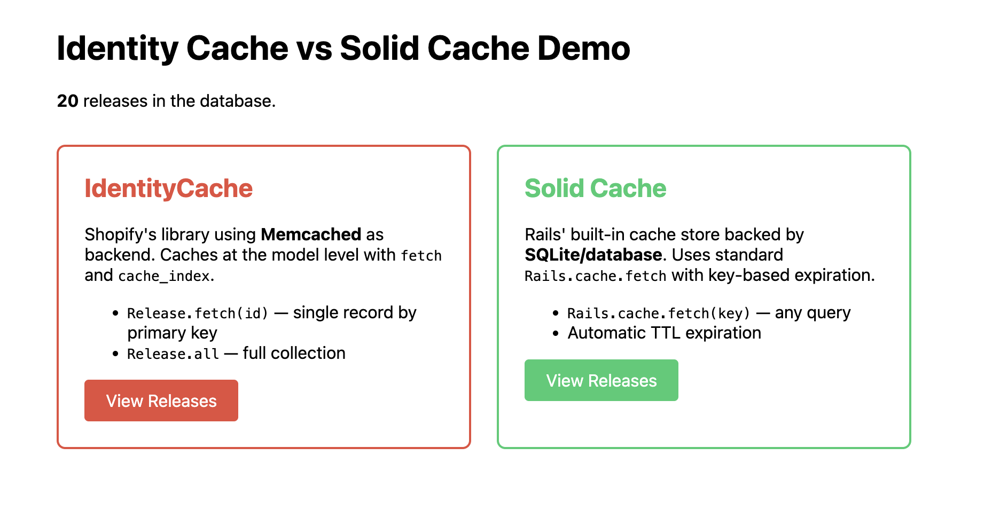
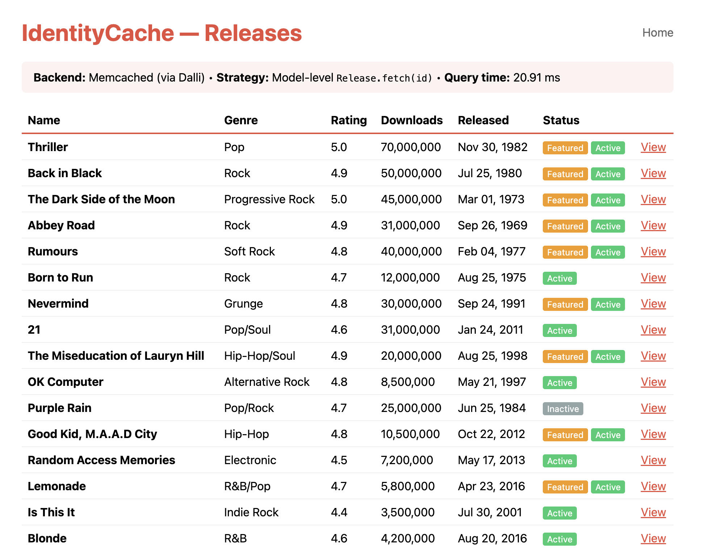
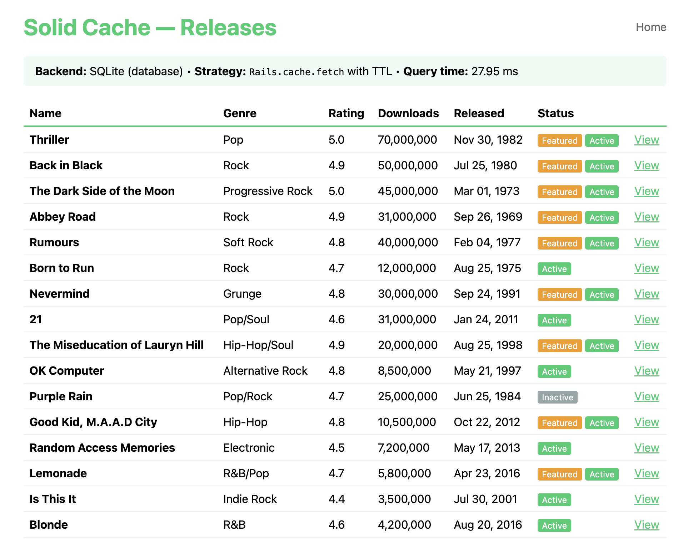

# Identity Cache vs Solid Cache Demo

A Rails 7.2 demo application comparing two caching strategies side by side using the same dataset of music releases.

## Purpose

This project demonstrates the differences between [IdentityCache](https://github.com/Shopify/identity_cache) (Shopify's model-level caching library backed by Memcached) and [Solid Cache](https://github.com/rails/solid_cache) (Rails' database-backed cache store) so you can evaluate which approach fits your needs.

Both controllers serve the same `Release` model data, making it easy to compare their APIs, query times, and caching behavior.



## How It Works

### IdentityCache (`/identity_cache/releases`)

Uses Shopify's `identity_cache` gem which caches at the **model level**. Records are fetched via `Release.fetch(id)` instead of `Release.find(id)` — the gem intercepts the lookup and serves it from cache when available.

- Cache is **automatically invalidated** when the record is updated or destroyed
- No manual key management needed
- Designed for Memcached (this demo uses MemoryStore for simplicity)



### Solid Cache (`/solid_cache/releases`)

Uses Rails' built-in `Rails.cache.fetch` with `solid_cache_store` as the backend, which stores cache entries in a **SQLite database** instead of memory or Redis.

- Uses explicit **key-based caching** with TTL (`expires_in: 5.minutes`)
- You control the cache key and expiration
- No external dependencies — cache lives in the database



## Setup

```bash
git clone <repo-url>
cd identity-cache-demo
bin/setup
bin/rails db:seed
bin/rails server
```

Then visit [http://localhost:3000](http://localhost:3000).

## Requirements

- Ruby 3.4.8
- SQLite3

No Memcached or Redis needed — IdentityCache is configured with MemoryStore for this demo.

## Key Files

| File | Description |
|------|-------------|
| `app/models/release.rb` | Model with `include IdentityCache` |
| `app/controllers/identity_cache/releases_controller.rb` | Uses `Release.fetch(id)` |
| `app/controllers/solid_cache/releases_controller.rb` | Uses `Rails.cache.fetch` with TTL |
| `config/initializers/identity_cache.rb` | IdentityCache backend config |
| `config/environments/development.rb` | Solid Cache store config |

## Tests

```bash
bin/rails test
```
